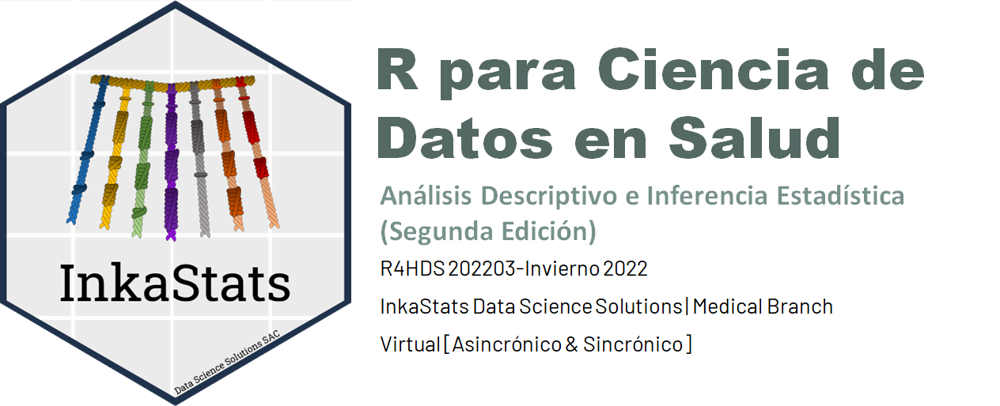

_v.1.0.0_ (Released) 

<!--  -->

# R para Ciencia de Datos en Salud 3: Análisis Descriptivoe e Inferencia Estadística

<!-- badges: start -->
<!-- badges: end -->

The goal of `r4hds-curso3-inkstat` is to provide the source code of the course website: 
__"R FOR HEALTH DATA SCIENCE 3: DESCRIPTIVE ANALYSIS AND STATISTICAL INFERENCE"__. This course was thaught in Spanish in the winter of 2022.

### Web page

Link:

This web page is largerly based on the source code proportioned by [Andrew Heiss](https://github.com/andrewheiss/evalf22.classes.andrewheiss.com) here: <https://github.com/andrewheiss/evalf22.classes.andrewheiss.com>

### Slides

### Contact

**Percy Soto Becerra** | [`@psotob91`](https://https://twitter.com/psotob91) | <percys1991@gmail.com>

Project Link: 

### How to cite

<!-- > __Cite__: Soto-Becerra P. pain_prev [Internet]. Zenodo; 2022 [cited 2022 Feb 21]. Available from: 10.5281/zenodo.6204769 -->
